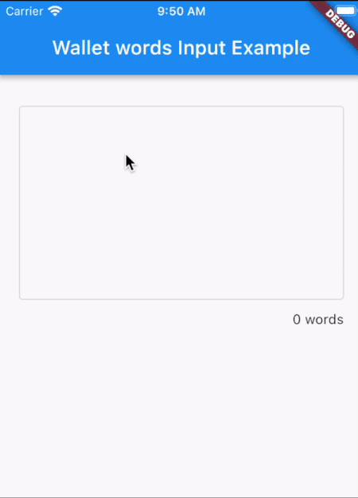
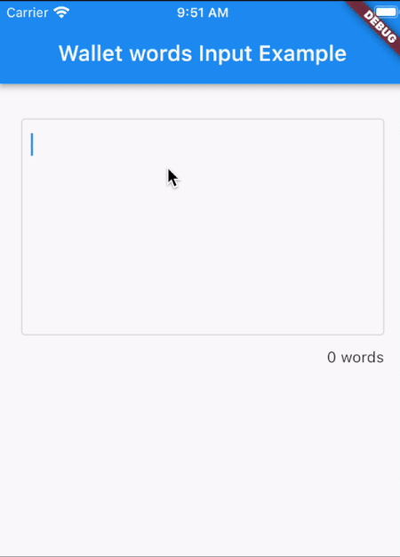
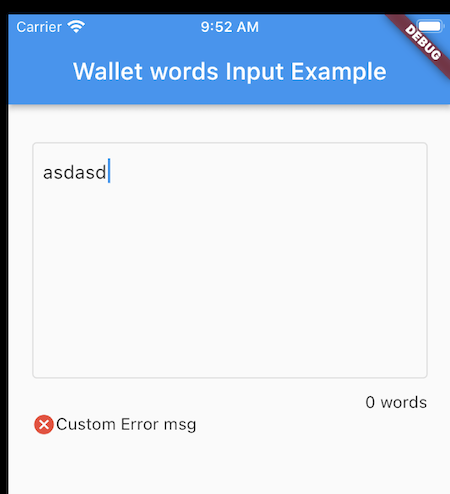

# wallet_words

Inspired by [Flutter Chips Input](https://pub.dev/packages/flutter_chips_input)

Flutter package used for building an input field that uses chips as inputs by the user. This package is mainly intenteded to use
for cryptocurrency wallets' words imports.

## Optimizations

Made the package more oriented to crypto wallets word importing. Updated all code to latest Dart SDK, added new functionality and some refactors.

## Usage

There are two builders: `chipBuilder` which returns a `(context, state, T data)` to build the desired chips and `suggestionsBuilder` if not `null`, returns `(context, state, T data)` to build a any kind of suggestions for the user to select, could be a List of words for example.

`findSuggestions` offers the capability to look up in the data and return query results to the `suggestionsBuilder`. `onChanged` returns the `List<T>`
of data whenever it has changed.

Other useful features are showing the `wordCountText` which is a `Widget` at the bottom right of the text box to show how many words the user has typed and error/info/success messages to give the user some feedback.

See the example for more info.

### Select suggestions or type

You can provide the user with a list of suggestions (see `suggestionsBuilders`) for they to select one or let them type themselves.
Word count will also increase as the user types.



### Paste Words

Users can also paste a list of words:



### Custom Message

You can let the user know the status of their process by passing a `Widget` into in the `feedbackMsg` parameter:



### Installation

Follow installation instructions [here](https://pub.dartlang.org/packages/wallet_words#-installing-tab-)

### Import

```dart
import 'package:wallet_words/wallet_words.dart';
```

### Example

```dart
WordsChip<String>(
    key: _chipKey,
    chipBuilder: (context, state, String word) {
        return InputChip(
        key: ObjectKey(word),
        label: Text(word),
        onDeleted: () => state.deleteChip(word),
        );
    },
    suggestionBuilder: (context, state, String word, qty) {
        return ListTile(
        key: ObjectKey(word),
        title: Text(word),
        onTap: () => state.selectSuggestion(word),
        );
    },
    findSuggestions: (String query) {
        if (query.isNotEmpty) {
        final lowercaseQuery = query.toLowerCase();
        return mockWords.where((word) {
            return word.toLowerCase().contains(query.toLowerCase());
        }).toList(growable: false)
            ..sort(
            (a, b) =>
                a.toLowerCase().indexOf(lowercaseQuery).compareTo(
                        b.toLowerCase().indexOf(lowercaseQuery),
                    ),
            );
        }
        return mockWords;
    },
    onChanged: (List<String> data) {
        setState(() {
        _wordCount = data.length;
        });
    },
    tooltip: SizedBox(
            width: 70.sp,
            height: 35.sp,
            child: const Center(
            child: Text(
                'Paste',
                style: TextStyle(
                fontFamily: 'Roboto',
                fontSize: 12,
                color: Colors.white,
                ),
            ),
            ),
        ),
        tooltipArrowHeight: 5,
        ),
),
```
